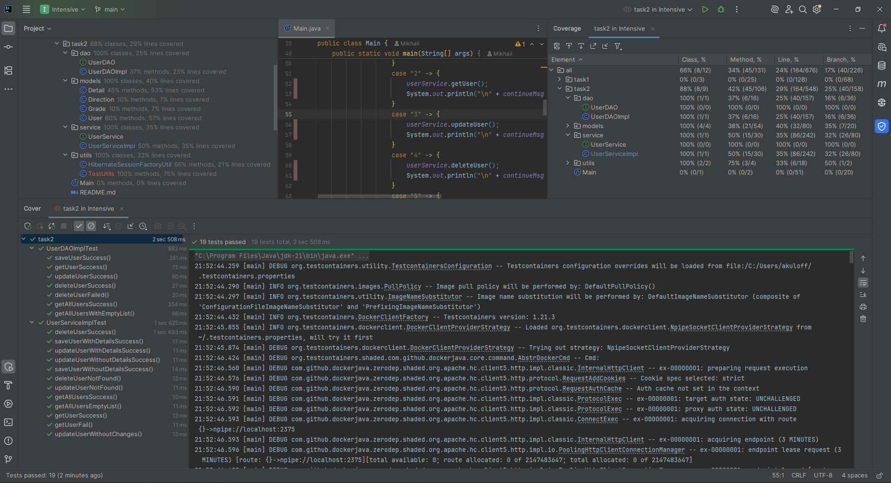

## Модуль 3. Тестирование. JUnit & Mockito. SOLID

---

### Задача:
Написать юнит-тесты и интеграционные тесты для user-service.

### Требования:
* Использовать JUnit 5, Mockito и Testcontainers.
* Для тестирования `DAO-слоя` написать интеграционные тесты с использованием Testcontainers.
* Для тестирования `Service-слоя` написать юнит-тесты с использованием Mockito.
* Тесты должны быть изолированы друг от друга.

---
### Описание:
* User-service разработан в директории [task2](https://github.com/MikhailAkulov/Aston/tree/main/src/main/java/task2).
* Директория с [тестами](https://github.com/MikhailAkulov/Aston/tree/main/src/test/java/task2).
* Прямая ссылка на:
  * [UserDAOImplTest](https://github.com/MikhailAkulov/Aston/blob/main/src/test/java/task2/dao/UserDAOImplTest.java)
  * [UserServiceImplTest](https://github.com/MikhailAkulov/Aston/blob/main/src/test/java/task2/service/UserServiceImplTest.java)
* Покрытие:
